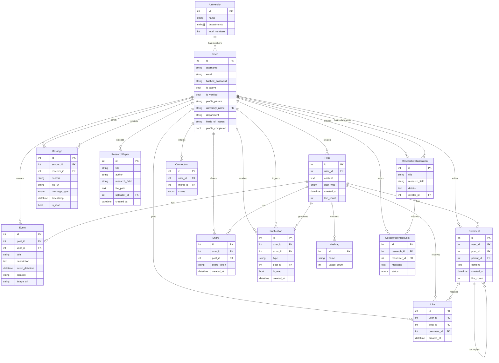

# UConnect Database Schema

## Diagram Overview

This ER diagram represents the database schema for UConnect, a university-focused social platform. Here are the key relationships:

### Core Entities
- **User**: Central entity with profile information and university affiliation
- **Post**: Main content type that can include text, media, or events
- **Event**: Special type of post for university events
- **Message**: Enables direct communication between users

### Academic Features
- **ResearchPaper**: For sharing academic papers
- **ResearchCollaboration**: For finding research partners
- **University**: Maintains list of universities and departments

### Social Features
- **Comment**: Nested comment system
- **Like**: For posts and comments
- **Share**: Post sharing system
- **Connection**: Friend/connection system
- **Notification**: Activity notifications
- **Hashtag**: For categorizing posts

### Key Relationships
1. Users can create multiple posts, comments, likes, etc.
2. Posts can have multiple comments, likes, and shares
3. Comments can have nested replies
4. Research collaborations can have multiple requests
5. Messages connect two users (sender and receiver)
6. Users can have multiple connections (friends)
